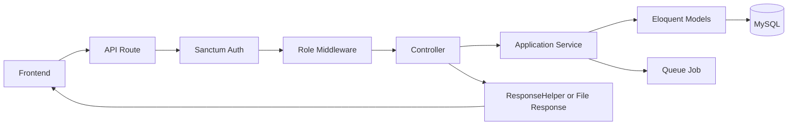
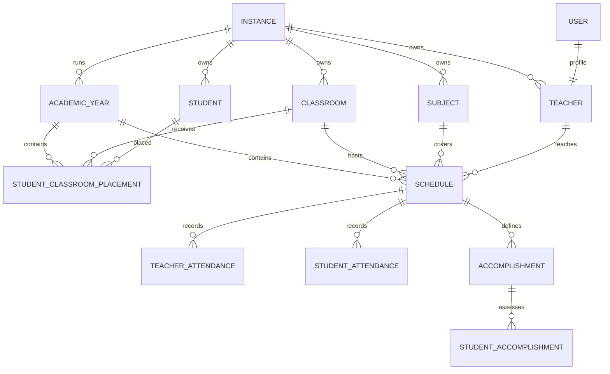

# Arsitektur Backend SIPTA untuk Integrasi Frontend

Dokumen ini memetakan arsitektur `sipta-be/` sebagai integration boundary untuk
refactor frontend. Backend tidak menjadi target refactor pada pekerjaan layout
FE. Perubahan backend hanya diperlukan jika ditemukan kontrak yang salah,
ambigu, tidak aman, atau belum menyediakan use case yang wajib.

Dokumen domain backend yang lebih rinci tetap berada di `sipta-be/docs/`.

## 1. Runtime dan komponen

- Laravel 8 / PHP 7.3+
- Laravel Sanctum untuk bearer-token authentication
- MySQL sebagai database utama
- RabbitMQ untuk queued attendance report
- Dompdf untuk PDF report
- Laravel Excel/PhpSpreadsheet untuk export spreadsheet
- Laravel scheduler untuk report berkala

Base path API adalah `/api/v1`.

## 2. Struktur aplikasi saat ini

```text
sipta-be/
├── routes/api.php                 # HTTP route dan middleware boundary
├── app/Http/
│   ├── Controllers/               # request orchestration dan response
│   └── Middleware/                # auth/role enforcement
├── app/Services/                  # workflow dan aturan bisnis lintas model
├── app/Models/                    # Eloquent entity dan relationships
├── app/Lib/ResponseHelper.php     # response envelope
├── app/Exceptions/                # business-rule exception
├── app/Jobs/                      # queued work
├── app/Exports/                   # spreadsheet export
├── app/Mail/                      # email report
├── config/santrack.php            # threshold dan formula bisnis
├── database/migrations/           # schema dan reconciliation
├── database/seeders/              # development/bootstrap data
├── resources/views/export/        # PDF templates
├── tests/Feature/                 # workflow/API behavior
├── tests/Unit/                    # domain calculation
└── docs/                          # architecture, rules, runbook, operations
```

Request flow:



Controller legacy tertentu masih mengandung business logic. Untuk FE, kontrak
aktual tetap ditentukan oleh route, validation, controller response, dan test;
jangan berasumsi semua endpoint sudah melalui service yang seragam.

## 3. Security boundary

Public endpoint:

- `POST /api/v1/auth/sign-in`

Endpoint lain berada di bawah `auth:sanctum`. Mutation administratif berada di
middleware `admin.rule`, termasuk promotion siswa.

Role yang relevan bagi FE saat ini:

- `admin`: master data, academic year workflow, schedule management, promotion,
  report/export, dan seluruh operation umum;
- `teacher`: dashboard/jadwal sendiri, attendance, classroom terkait, profile,
  serta report yang diperbolehkan route/controller.

Frontend boleh menyembunyikan menu berdasarkan role untuk UX, tetapi backend
adalah enforcement final. Perlakuan client:

- `401`: session invalid/expired;
- `403`: authenticated tetapi capability tidak cukup;
- `404`: resource tidak ada atau tidak berada dalam scope instance;
- `422`: aturan bisnis gagal;
- `400/422`: validation error, karena endpoint legacy belum seragam.

## 4. Multi-instance ownership

Instance adalah tenant boundary aplikasi. Teacher, student, classroom, subject,
dan academic year dimiliki satu instance. Query backend baru melakukan scoping
berdasarkan instance milik user authenticated.

Implikasi FE:

- jangan mengirim atau menggabungkan entity dari instance berbeda;
- jangan menganggap UUID yang valid pasti dapat diakses user;
- cache key server state wajib menyertakan instance saat relevan;
- setelah instance/session berubah, seluruh cache tenant harus dibersihkan;
- `404` hasil scoping tidak boleh otomatis dianggap server bug.

## 5. Domain map



Aggregate boundary penting bagi FE:

- **Instance** memiliki master data.
- **Academic year** memiliki aktivitas satu semester.
- **Placement** menentukan kelas siswa untuk semester tertentu.
- **Schedule** menjadi root attendance dan learning outcome.

## 6. Academic year lifecycle

Satu academic year row merepresentasikan satu semester:

```text
draft -> active -> closed
```

Hanya satu semester boleh aktif per instance. `periode` bernilai `ganjil` atau
`genap`.

Workflow:

- ganjil ke genap: rollover mempertahankan classroom placement;
- genap closed ke ganjil berikutnya: promotion membuat keputusan dan placement
  tujuan tanpa menimpa histori;
- semester closed tidak boleh menerima mutation operasional yang dilarang rule.

Endpoint workflow admin:

| Method | Path | Payload penting |
| --- | --- | --- |
| `POST` | `/admin/academic-years/{source_id}/rollover` | `target_academic_year_id` |
| `POST` | `/admin/academic-years/{id}/close` | tidak ada body wajib |
| `POST` | `/students/promoted` | `student_ids`, `source_academic_year_id`, `target_academic_year_id`, `target_classroom_id`, optional `override_reason` |

FE harus memodelkan workflow sebagai command dengan confirm/result state, bukan
sekadar toggle `is_active` atau `is_promoted`.

## 7. Student placement

`student_classroom_placements` adalah sumber kebenaran classroom siswa per
academic year. Satu siswa hanya memiliki satu placement dalam satu semester.

`students.classroom_id` adalah field transitional. Kode FE baru dilarang
menggunakan field tersebut untuk:

- menentukan roster schedule;
- menampilkan histori kelas;
- memilih target promotion;
- menghitung jumlah/capacity classroom;
- membuat cache key.

Seluruh layar classroom/student harus memiliki academic-year context eksplisit.

## 8. Schedule, attendance, dan assessment

Schedule mengikat academic year, classroom, subject, teacher, tanggal, dan slot
waktu. Backend menolak overlap teacher/classroom sesuai aturan service.

Field utama:

- `status`: `scheduled`, `in_progress`, `completed`, `cancelled`;
- `assessment_period`: `regular`, `uts`, `uas`;
- `completed_at`;
- `is_completed`: compatibility field sementara.

Attendance dan assessment ditulis secara idempotent. Retry request yang sama
tidak boleh membuat row duplikat. Finalisasi attendance siswa membuat absent row
untuk roster yang tidak disertakan agar denominator tidak mengecil.

FE wajib:

- mengirim ID schedule dan payload lengkap sesuai validation;
- mencegah double-submit untuk UX, tanpa menganggap client sebagai satu-satunya
  penjaga idempotensi;
- menampilkan business-rule message dari backend;
- menggunakan `status`, bukan menurunkan status hanya dari check-in/check-out;
- mengisolasi pembacaan `is_completed` di compatibility mapper.

## 9. Performance dan report

Backend menghitung performance per subject:

```text
final subject score = regular 40% + UTS 25% + UAS 35%
```

Attendance adalah dimensi laporan dan promotion eligibility yang terpisah.
Backend juga mengembalikan metadata bobot dan promotion recommendation.

Endpoint canonical:

| Method | Path | Keterangan |
| --- | --- | --- |
| `GET` | `/reports/performance-students/{classroom_id}` | Performance satu classroom |
| `GET` | `/reports/performance-students/student/{student_id}` | Performance satu student |
| `GET` | `/reports/performance-students/student/{student_id}/export/pdf` | PDF blob |
| `GET` | `/reports/academic-year-summary` | Ringkasan academic year |
| `GET` | `/reports/attendances-teacher` | Report attendance guru |
| `GET` | `/admin/attendance-teachers/export` | Export blob, admin-only |

Performance GET mendukung query `academic_year_id`. Tanpa query tersebut,
backend menggunakan semester aktif. Layar histori FE wajib mengirimkannya.

Alias salah eja `/reports/perfomance-students/...` masih transitional untuk
client lama dan tidak boleh dipakai implementasi FE baru.

## 10. Response contract

Envelope sukses normal:

```json
{
  "success": true,
  "message": "Data berhasil dimuat.",
  "data": {}
}
```

Envelope gagal normal:

```json
{
  "success": false,
  "message": "Validasi gagal.",
  "errors": {}
}
```

Catatan integrasi:

- `data` dan `errors` opsional;
- beberapa endpoint legacy membungkus validation errors satu level tambahan;
- beberapa response legacy masih memakai bentuk JSON langsung;
- export PDF/Excel adalah file/blob;
- FE API adapter harus menormalisasi perbedaan, bukan page/component;
- perubahan response backend harus memiliki fixture/test contract sebelum FE
  menghapus adapter kompatibilitas.

## 11. Endpoint groups yang dikonsumsi FE

Semua path relatif terhadap `/api/v1`.

| Area | Read | Mutation |
| --- | --- | --- |
| Auth | `/me` | `/auth/sign-in`, `/auth/sign-out`, `/auth/change-password` |
| Academic year | `/instance/academic-years` | CRUD `/admin/instance/academic-year`, close, rollover |
| Teacher | `/teachers`, `/teachers/{id}` | create/delete `/admin/teachers`, update `/teachers/{id}` |
| Classroom | `/classrooms`, `/teachers/classrooms/{id}` | CRUD `/admin/classrooms` |
| Student | `/students`, `/students/{id}` | CRUD `/students`, placement, promotion |
| Subject | `/schedules/subjects/get` | CRUD `/schedules/subjects` |
| Schedule | `/schedules`, `/schedules/today`, `/schedules/{id}`, `/incomplete-schedules` | CRUD `/admin/schedules`, completion/accomplishment |
| Attendance | attendance GET routes | attendance student/teacher mutation |
| Report | performance, attendance, summary | performance update legacy, export |

Route file adalah sumber kebenaran bila tabel ini tertinggal.

## 12. Queue, scheduler, dan file

Attendance report dapat diproses melalui RabbitMQ queue. Scheduler Laravel
men-dispatch report berkala. Dari perspektif FE:

- request yang memulai pekerjaan async tidak boleh diasumsikan langsung
  menghasilkan file bila response menyatakan queued;
- UI perlu membedakan submitted, processing, success, dan failure bila endpoint
  async diperkenalkan;
- file URL berasal dari asset base URL, bukan API base URL;
- upload memakai multipart form data;
- download memakai blob dan filename dari response header bila tersedia.

## 13. Contract verification untuk refactor FE

Sebelum memigrasikan satu feature:

1. cek route dan middleware;
2. cek request validation/controller;
3. rekam response success, empty, forbidden, validation, business-rule, dan
   not-found;
4. buat fixture/schema DTO FE;
5. implementasikan repository/adapter;
6. jalankan test backend terkait dan contract test FE;
7. baru pindahkan UI feature.

Command verifikasi backend:

```bash
cd sipta-be
php artisan test
php artisan route:list --path=api
php artisan santrack:audit-data
```

Audit data relevan sebelum menguji placement, promotion, report, atau schedule
pada database hasil migrasi.

## 14. Compatibility register

| Legacy contract | Target | Pemilik cleanup |
| --- | --- | --- |
| `students.classroom_id` | `student_classroom_placements` | Backend menjaga transisi; FE berhenti membaca |
| `schedules.is_completed` | `status` + `completed_at` | FE mapper sementara, lalu backend migration terpisah |
| `/reports/perfomance-students` | `/reports/performance-students` | FE pindah lebih dulu, backend hapus alias kemudian |
| Formula report legacy di client/controller | `StudentPerformanceService` result | FE hanya render hasil backend |
| Response shape endpoint legacy | `ResponseHelper` envelope | FE adapter sementara; backend standardisasi terpisah |

Tidak ada compatibility contract yang boleh dipakai langsung oleh component.

## 15. Batas perubahan backend selama refactor FE

Diizinkan bila benar-benar dibutuhkan:

- menambah test/fixture contract;
- memperbaiki route yang tidak dapat digunakan sesuai use case terdokumentasi;
- menstandardisasi response tanpa memutus consumer, melalui alias/versioning;
- memperbaiki bug security, tenant scoping, atau business rule;
- menambah endpoint read model bila komposisi client menyebabkan request
  berlebihan dan use case sudah jelas.

Tidak termasuk scope:

- memindahkan folder/layer backend hanya agar simetris dengan FE;
- mengganti framework, database, queue, atau auth mechanism;
- mengubah formula, promotion, placement, atau lifecycle dari sisi FE;
- menghapus field/route transitional sebelum seluruh consumer terverifikasi.

Setiap perubahan backend selama refactor FE harus diperlakukan sebagai kontrak
terpisah: test backend lebih dahulu, dokumentasi diperbarui, lalu adapter FE.

