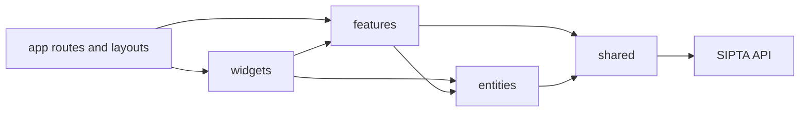
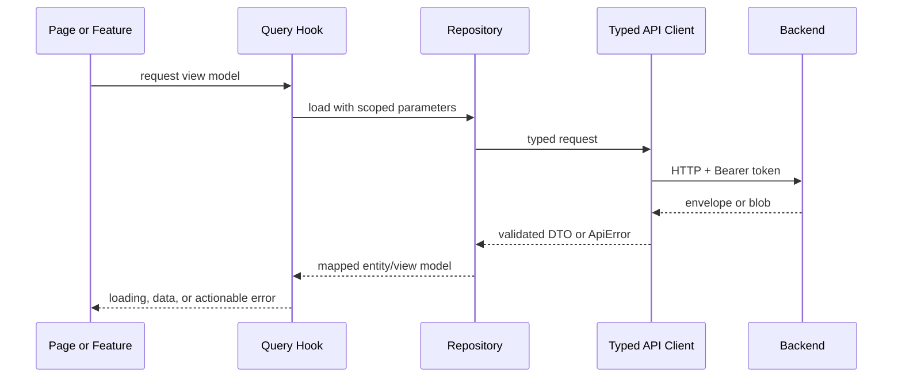

# Arsitektur Frontend SIPTA

Dokumen ini adalah target architecture untuk refactor `sipta-fe/`, terutama agar
layout dapat di-upgrade tanpa mengulang perubahan pada setiap halaman. Refactor
dilakukan bertahap dan tidak mengubah URL publik maupun aturan bisnis backend.

Dokumen kontrak lintas aplikasi tetap berada di [`README.md`](README.md),
sedangkan backend boundary dijelaskan di
[`architecture-be.md`](architecture-be.md).

## 1. Tujuan

- Satu application shell untuk seluruh halaman authenticated.
- Layout desktop, tablet, dan mobile dapat berevolusi tanpa menyentuh feature.
- Komponen visual memakai token dan primitive bersama, bukan warna atau spacing
  hardcoded per halaman.
- Kontrak backend diperiksa pada API boundary dan tidak bocor mentah ke UI.
- Session, server state, form state, dan local UI state memiliki pemilik jelas.
- Page hanya mengomposisikan feature; request, mapping, dan aturan akses tidak
  tersebar di page/component.
- Refactor dapat dirilis per vertical slice tanpa big-bang rewrite.

## 2. Kondisi sekarang

`sipta-fe` menggunakan Next.js 15 App Router, React 19, TypeScript, Zustand,
Axios, HeroUI, Tailwind CSS 4, Framer Motion, dan beberapa library visualisasi.

Masalah utama yang ditemukan:

- `HeaderComponent` dan `ProtectedRoute` dipasang ulang di banyak page.
- Hampir semua page adalah client component sehingga boundary server/client
  terlalu tinggi.
- Header menangani brand, desktop navigation, mobile navigation, profile menu,
  session parsing, dan logout modal dalam satu komponen.
- Komponen masih membaca `localStorage` langsung dan membentuk state turunan
  sendiri.
- Zustand menyimpan server state sekaligus session dan mutation flow.
- Domain interface terduplikasi; banyak response dan props memakai `any`.
- Styling memakai utility dan warna langsung sehingga perubahan brand/layout
  harus dilakukan di banyak lokasi.
- `globals.css` mencampur token, animation, dan override library pihak ketiga.
- Halaman besar menggabungkan data fetching, transformasi, permission, modal,
  dan presentasi.

Konsekuensinya, upgrade layout sekarang berisiko memengaruhi auth, data flow,
dan perilaku feature. Refactor harus membuat layout sebagai boundary tersendiri.

## 3. Prinsip arsitektur

1. **App shell owns layout.** Page tidak merender header/sidebar/navigation.
2. **Feature owns interaction.** Feature menangani use case, bukan page atau
   primitive UI.
3. **Entity owns domain representation.** DTO, schema, mapper, dan komponen
   representasi reusable dikelompokkan per entity.
4. **Shared has no domain dependency.** `shared/` tidak mengimpor feature atau
   entity.
5. **API data is untrusted.** Response divalidasi dan dipetakan sebelum masuk
   view.
6. **Backend owns business rules.** FE tidak menghitung nilai akhir, promotion,
   overlap jadwal, atau status lifecycle secara independen.
7. **Accessibility is a constraint.** Bukan pekerjaan polish setelah layout
   selesai.
8. **Compatibility is temporary.** Adapter legacy terisolasi, diberi alasan,
   dan memiliki fase penghapusan.

Dependency direction:



Import ke arah sebaliknya dilarang. `shared` tidak mengetahui entity;
`entities` tidak mengetahui feature; feature tidak mengimpor route/page.

## 4. Struktur target

Route groups Next.js menjaga URL lama tetap sama sambil memisahkan shell.

```text
sipta-fe/
├── app/
│   ├── layout.tsx                    # document, font, global providers
│   ├── providers.tsx                 # provider client minimum
│   ├── (public)/
│   │   ├── layout.tsx                # public/auth shell
│   │   └── auth/login/page.tsx
│   ├── (workspace)/
│   │   ├── layout.tsx                # auth gate + AppShell satu kali
│   │   ├── page.tsx                  # dashboard
│   │   ├── teachers/page.tsx
│   │   ├── classroom/page.tsx
│   │   ├── classroom/[...]/page.tsx
│   │   ├── schedules/page.tsx
│   │   ├── reports/page.tsx
│   │   └── profile/page.tsx
│   ├── 403/page.tsx
│   ├── not-found.tsx
│   └── global-error.tsx
├── src/
│   ├── shared/
│   │   ├── api/                      # client, envelope, ApiError
│   │   ├── config/                   # typed environment
│   │   ├── lib/                      # date, file, formatter murni
│   │   ├── styles/                   # tokens, base, vendor overrides
│   │   └── ui/                       # Button, Card, Dialog, Field, ...
│   ├── entities/
│   │   ├── academic-year/
│   │   ├── classroom/
│   │   ├── schedule/
│   │   ├── student/
│   │   ├── subject/
│   │   ├── teacher/
│   │   └── user/
│   ├── features/
│   │   ├── auth/
│   │   ├── manage-academic-year/
│   │   ├── manage-schedule/
│   │   ├── record-attendance/
│   │   ├── manage-classroom/
│   │   ├── promote-students/
│   │   └── view-reports/
│   └── widgets/
│       ├── app-shell/
│       ├── page-header/
│       ├── schedule-board/
│       └── report-workspace/
└── tests/
    ├── contract/
    ├── component/
    └── e2e/
```

Folder tidak dibuat sekaligus. Buat hanya ketika vertical slice pertama
membutuhkannya.

## 5. Application shell

`app/(workspace)/layout.tsx` menjadi satu-satunya pemilik layout authenticated:

```text
AppShell
├── SkipLink
├── Sidebar / NavigationDrawer
├── Topbar
│   ├── MobileMenuButton
│   ├── ContextSummary
│   └── AccountMenu
├── MainContent
│   ├── Breadcrumbs
│   └── route children
└── MobileBottomNavigation
```

Tanggung jawab shell:

- autentikasi dan redirect awal;
- navigasi berbasis capability/role;
- brand instance dan semester yang sedang dipilih;
- responsive sidebar/drawer/bottom navigation;
- batas lebar, gutter, scroll container, dan safe area;
- global toast serta dialog host;
- focus restoration setelah navigasi atau drawer ditutup.

Shell tidak boleh mengambil data feature seperti daftar siswa atau jadwal.
Shell hanya memakai `SessionContext` dan `WorkspaceContext` yang ramping.

### Responsive layout

| Breakpoint | Navigasi | Content behavior |
| --- | --- | --- |
| `< 768px` | Topbar ringkas + bottom navigation; menu tambahan di drawer | Satu kolom, edge padding 16 px, action utama mudah dijangkau ibu jari |
| `768–1279px` | Sidebar drawer/collapsible | Grid adaptif, filter dapat menjadi drawer |
| `>= 1280px` | Sidebar persistent 256–280 px | Area kerja fleksibel; max-width hanya untuk form/readable content |

Desktop navigation tidak lagi disimpan di header horizontal. Ini memberi ruang
untuk nama instance, semester, global action, dan account menu tanpa overflow.

Bottom navigation mobile hanya memuat empat tujuan paling sering dipakai.
Tujuan admin atau menu sekunder masuk ke drawer; daftar item berasal dari satu
navigation config agar label, icon, capability, dan active state konsisten.

## 6. Design system dan upgrade visual

HeroUI boleh tetap dipakai sebagai implementation detail, tetapi feature tidak
bergantung langsung pada style HeroUI. Semua feature memakai primitive wrapper
di `shared/ui` agar library atau tema dapat diganti bertahap.

Layer styling:

```text
tokens.css -> base.css -> shared UI -> feature styles -> vendor overrides
```

Gunakan semantic token, bukan warna berdasarkan nama:

```css
:root {
  --surface-canvas: ...;
  --surface-panel: ...;
  --surface-elevated: ...;
  --content-primary: ...;
  --content-secondary: ...;
  --border-subtle: ...;
  --action-primary: ...;
  --status-success: ...;
  --status-warning: ...;
  --status-danger: ...;
  --radius-control: ...;
  --radius-panel: ...;
  --shadow-panel: ...;
}
```

Token minimum:

- color: surface, content, border, action, dan status;
- typography: display, heading, body, label, caption;
- spacing: skala 4 px;
- radius, shadow, z-index, motion duration, dan easing;
- control height serta content gutter;
- chart palette yang memenuhi kontras.

Primitive awal yang harus stabil sebelum redesign halaman:

- `Button`, `IconButton`, `LinkButton`;
- `TextField`, `SelectField`, `DateField`, `FileField`;
- `Card`, `Surface`, `Divider`, `Badge`;
- `Dialog`, `Drawer`, `DropdownMenu`, `Tooltip`;
- `DataTable`, `Pagination`, `FilterBar`;
- `EmptyState`, `ErrorState`, `Skeleton`, `InlineAlert`;
- `PageHeader`, `SectionHeader`, `StatCard`.

Aturan aksesibilitas:

- target sentuh minimum 44 × 44 px;
- focus ring tidak boleh dihapus;
- contrast minimal WCAG AA;
- icon-only action wajib memiliki accessible name;
- dialog melakukan focus trap dan mengembalikan focus saat ditutup;
- status tidak disampaikan hanya dengan warna;
- hormati `prefers-reduced-motion`;
- `html lang` diganti menjadi `id`.

## 7. Page composition

Setiap page memakai pola yang konsisten:

```text
Page
├── PageHeader(title, description, primary action)
├── Context/Status banner (optional)
├── Summary cards (optional)
├── FilterBar (optional)
├── Main view (table, cards, calendar, report)
└── Dialog/Drawer feature entry points
```

Page bertanggung jawab pada komposisi dan route params saja. Feature component
bertanggung jawab pada interaction. Entity component bertanggung jawab pada
representasi satu entity. Shared UI tidak memahami SIPTA.

Untuk data-heavy screen:

- desktop memakai table/split view bila perbandingan data penting;
- mobile memakai card/list dengan detail di page atau full-screen drawer;
- action massal muncul di contextual action bar setelah selection;
- filter tercermin di URL agar dapat dibagikan dan tidak hilang saat refresh;
- loading mempertahankan struktur layout untuk mencegah layout shift.

## 8. State dan data flow

Pisahkan empat jenis state:

| State | Pemilik target | Contoh |
| --- | --- | --- |
| Session | Auth store/context | token, current user, role, instance |
| Server state | Query/repository layer | teachers, schedules, reports, classrooms |
| URL state | Next router/search params | filter, pagination, selected semester |
| Local UI/form | Component/form hook | dialog terbuka, input draft, selection |

Zustand dipertahankan hanya untuk session atau state lintas feature yang benar-
benar client-owned. Store daftar entity saat ini dimigrasikan menuju query
hooks dengan cache key yang menyertakan instance dan academic year.

TanStack Query direkomendasikan untuk server-state caching, invalidation,
deduplication, dan mutation lifecycle. Karena belum menjadi dependency saat
ini, penambahannya harus dicatat sebagai keputusan implementasi. Tanpa library
tersebut, repository layer tetap wajib menyediakan semantics yang sama dan
tidak boleh kembali menyebarkan fetch manual ke page.

Alur data:



## 9. Auth dan authorization

- Satu auth bootstrap berjalan di root provider, bukan di setiap page.
- Satu interceptor dipasang tepat sekali dan dapat di-eject saat diperlukan.
- Component tidak membaca atau menulis `auth-storage` secara langsung.
- `401` membersihkan session lalu menuju login dengan safe return URL.
- `403` mempertahankan session dan menuju forbidden state/page.
- Navigation visibility memakai capability config, tetapi backend tetap menjadi
  enforcement final.
- Protected workspace layout menahan render sampai hydration/session check
  selesai agar tidak terjadi flash halaman terlarang.
- Token tidak dicetak ke log atau error telemetry.

Jika backend tetap menggunakan bearer token di localStorage, risiko XSS harus
didokumentasikan. Migrasi ke HttpOnly cookie membutuhkan perubahan backend dan
tidak termasuk scope refactor FE saat ini.

## 10. API boundary

`shared/api` menyediakan:

- konfigurasi base URL tervalidasi;
- Bearer token injection;
- envelope unwrap;
- `ApiError` dengan `status`, `message`, `fieldErrors`, dan `details`;
- blob download dengan ekstraksi filename;
- cancellation dan timeout;
- mapping `400/422` ke field/form error;
- mapping business rule `422` ke actionable error;
- adapter transitional yang eksplisit.

Entity repository tidak mengembalikan `AxiosResponse`. Ia mengembalikan DTO
tervalidasi atau domain model. Feature tidak mengetahui path endpoint.

## 11. Performance

- Pertahankan root layout sebagai server component.
- Turunkan `"use client"` ke interactive leaf sekecil mungkin.
- Dynamic import untuk map, webcam, calendar, chart, dan export dialog.
- Jangan memuat Leaflet/calendar CSS atau JavaScript pada route yang tidak
  menggunakannya bila dapat dihindari.
- Gunakan `next/image` untuk asset yang kompatibel dan tetapkan dimensions.
- Virtualisasi hanya untuk list besar yang sudah terbukti bermasalah.
- Ukur bundle per route dan Core Web Vitals sebelum/sesudah setiap fase.

Target awal, bukan SLA final:

- tidak ada layout shift dari shell setelah hydration;
- route shell interaktif tanpa menunggu data feature;
- chunk map/chart/calendar tidak masuk initial bundle dashboard bila tidak
  dibutuhkan;
- skeleton mengikuti dimensi final content.

## 12. Testing dan quality gate

Test pyramid FE:

- unit: formatter, schema, mapper, permission, navigation config;
- component: primitive UI dan feature state utama;
- contract: fixture response backend terhadap schema DTO;
- integration: auth bootstrap, API errors, cache invalidation;
- E2E: login, attendance, schedule, semester, promotion, report/export.

Command target:

```bash
npm run lint
npm run type-check
npm run test
npm run build
npm run test:e2e
```

`type-check`, `test`, dan `test:e2e` belum tersedia dan harus ditambahkan pada
fase fondasi.

## 13. Strategi migrasi layout

### Tahap A — Fondasi tanpa redesign

1. Tambahkan semantic token dan shared primitives dengan visual sedekat mungkin
   ke UI lama.
2. Buat navigation config dan session selectors.
3. Buat `(public)` dan `(workspace)` layout tanpa mengubah URL.
4. Pindahkan auth gate, header, toast, dan navigation ke `AppShell`.
5. Verifikasi parity seluruh route pada mobile dan desktop.

### Tahap B — Upgrade shell

1. Pecah header menjadi sidebar, topbar, account menu, dan mobile navigation.
2. Terapkan content gutter, page header, breadcrumbs, focus management, serta
   responsive behavior.
3. Upgrade satu halaman representatif—dashboard—untuk menguji design language.
4. Bekukan primitive dan token setelah review visual serta aksesibilitas.

### Tahap C — Migrasi vertical slice

Urutan yang direkomendasikan:

1. auth dan profile;
2. dashboard dan schedule;
3. classroom dan student;
4. teacher dan subject;
5. attendance;
6. academic year, rollover, dan promotion;
7. reports dan export.

Untuk setiap slice: pindahkan API → DTO/schema → repository/query → feature →
page composition → test → hapus implementasi legacy slice tersebut.

### Tahap D — Cleanup

- hapus direct `localStorage` access;
- hapus store server-state legacy;
- hapus `any` dan interface duplikat;
- hapus `HeaderComponent`, `ProtectedRoute`, dan wrapper layout lama;
- pecah/hapus override global yang sudah digantikan token/primitive;
- hapus folder `backup/` setelah parity dan histori Git diverifikasi.

## 14. Definition of done layout upgrade

- Semua route authenticated berada dalam satu `AppShell`.
- Page tidak merender header, sidebar, bottom navigation, atau auth guard.
- Navigation berasal dari satu config dan menghormati capability.
- Desktop, tablet, dan mobile memiliki behavior terdokumentasi dan teruji.
- Seluruh warna, spacing utama, radius, shadow, dan typography berasal dari
  semantic token.
- Feature memakai shared primitive, bukan style library secara langsung kecuali
  ada pengecualian terdokumentasi.
- Keyboard navigation, focus, dialog, contrast, dan reduced motion lulus audit.
- Tidak ada flash unauthorized content atau layout shift shell saat hydration.
- Lint, type-check, test, build, dan critical E2E flow lulus.

## 15. Di luar scope

- Mengubah aturan bisnis atau schema database backend.
- Mengganti endpoint backend hanya demi mengikuti struktur komponen FE.
- Migrasi token bearer ke cookie HttpOnly tanpa pekerjaan backend terpisah.
- Rebranding final tanpa keputusan visual/product owner.
- Mengganti semua library visual sekaligus.

