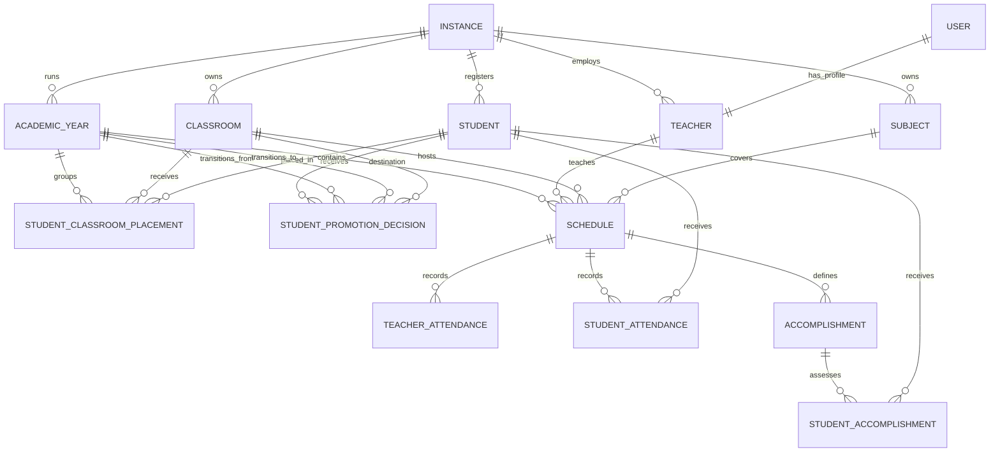

# Santrack Business Architecture

## Goals

Santrack is a multi-instance academic operations system. The core model follows
four rules:

1. `instances` own master data.
2. `academic_years` own period-specific activity.
3. `student_classroom_placements` are the only source of truth for a student's
   classroom in an academic year.
4. `schedules` are the aggregate root for attendance and learning outcomes.

## Domain map



## Aggregate rules

### Instance

- A teacher, student, classroom, subject, and academic year belongs to exactly
  one instance.
- References combined in a schedule must all belong to the same instance.
- Subject names and codes are unique within an instance, not globally.

### Academic year

- An instance may have only one active academic year at a time.
- One row represents one semester, identified by `name` plus `periode`
  (`ganjil` or `genap`), with lifecycle `draft`, `active`, or `closed`.
- Activating an academic year deactivates the previous active year in the same
  transaction.
- Ganjil to genap is rollover: active students retain the same classroom and
  receive a `continued` transition decision.
- Genap to the following ganjil is the only class-promotion boundary. The
  destination semester and classroom are selected explicitly.

### Student placement

- A student has at most one placement per academic year.
- `students.classroom_id` is legacy data and must not be used by new code.
- Moving a student within the same academic year updates that year's placement.
- Promoting a student creates or updates the target year's placement without
  changing historical placements.

### Schedule

- A schedule belongs to one academic year, classroom, subject, and teacher.
- Teacher and classroom time slots may not overlap.
- State moves through `scheduled`, `in_progress`, `completed`, or `cancelled`.
- `assessment_period` explicitly identifies `regular`, `uts`, or `uas`.
  UTS/UAS must never be inferred from a name.
- `is_completed` is retained temporarily as an API compatibility field and is
  synchronized with `status`.

### Attendance and assessment

- A student has at most one attendance row per schedule.
- A teacher has at most one attendance row per schedule and attendance type.
- Teacher attendance is reported per expected schedule. Check-in and check-out
  prove one teaching session, not two attendance events. Missing check-in is
  absent; late status uses start time plus the configured grace period.
- A student has at most one assessment per accomplishment.
- Attendance submission is idempotent: retrying the same request updates the
  existing records instead of adding duplicates.
- A schedule is completed only after all attendance and assessment writes
  succeed in one database transaction.
- Finalizing a session creates absent rows for roster students omitted from
  the request, so missing data cannot shrink the denominator.
- Capability uses one threshold configured by
  `santrack.assessment.skill_passing_score`.
- Outcomes retain the independent domains `knowledge`, `skill`, `attitude`,
  and `creativity`.
- Each subject is calculated independently using regular assessment 40%,
  UTS 25%, and UAS 35%. UTS/UAS are periods, not fake creativity dimensions.
- The overall report average is the mean of completed subject final scores.
  Attendance remains a separate report and promotion-eligibility dimension;
  it does not inflate or reduce an individual subject grade.
- `provisional_score` reweights available components. A subject `final_score`
  is emitted only after regular, UTS, and UAS are complete. Closing a semester
  does not convert missing scores into zero.
- Promotion recommendation only applies in genap. Defaults are final score
  >= 65 and attendance >= 75%; an admin override remains possible and its
  reason is stored with the decision.

## Semester state flow

```mermaid
flowchart LR
    ODD_DRAFT[Ganjil draft] -->|activate| ODD_ACTIVE[Ganjil active]
    ODD_ACTIVE -->|close| ODD_CLOSED[Ganjil closed]
    ODD_CLOSED -->|rollover same classroom| EVEN_DRAFT[Genap draft]
    EVEN_DRAFT -->|activate| EVEN_ACTIVE[Genap active]
    EVEN_ACTIVE -->|close| EVEN_CLOSED[Genap closed]
    EVEN_CLOSED -->|promotion decision| NEXT_ODD[Ganjil berikutnya]
```



## Performance formula

```text
subject_final = regular * 40%
      + UTS * 25%
      + UAS * 35%

report_average = average(all completed subject_final scores)
```

Completed classroom schedules are expected sessions. `present` and `late`
count as attended. Missing, absent, sick, and permission remain visible in the
breakdown but do not count as instructional presence.

## Transitional fields

The following fields exist only for backward compatibility and should be
removed after all deployed code reads the normalized model:

| Legacy field | Replacement |
| --- | --- |
| `students.classroom_id` | `student_classroom_placements` |
| `subjects.academic_year_id` | `subjects.instance_id` + `schedules.academic_year_id` |
| `schedules.is_completed` | `schedules.status` + `schedules.completed_at` |

## Application layer

Controllers validate transport concerns and delegate to use-case services:

- `AcademicYearService`
- `StudentPlacementService`
- `PromoteStudentsService`
- `SemesterTransitionService`
- `StudentPerformanceService`
- `TeacherAttendanceService`
- `RecordStudentAttendanceService`
- `ScheduleService`

These services own transactions and invariant checks. Eloquent models own
relationships and query scopes, not multi-step business workflows.

## Rollout

1. Restore a sanitized copy of production locally.
2. Run the reconciliation migration.
3. Run `php artisan santrack:audit-data`.
4. Resolve reported duplicates or cross-instance references.
5. Run tests and exercise attendance, promotion, schedule creation, and reports.
6. Deploy application code and migrations together.
7. Remove legacy columns only in a later release after usage has reached zero.

Operational details are documented in
[`production-migration-runbook.md`](production-migration-runbook.md).
