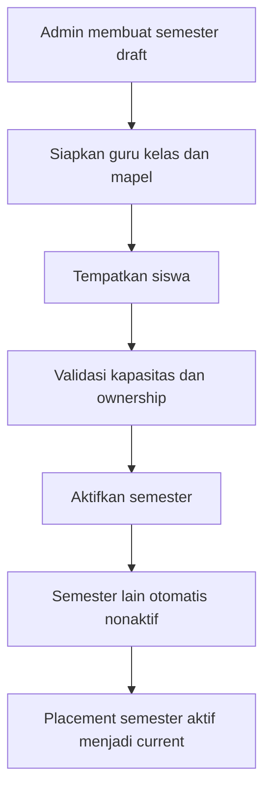
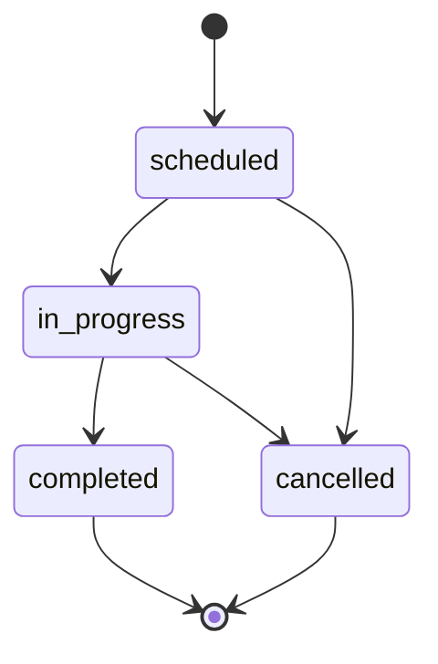
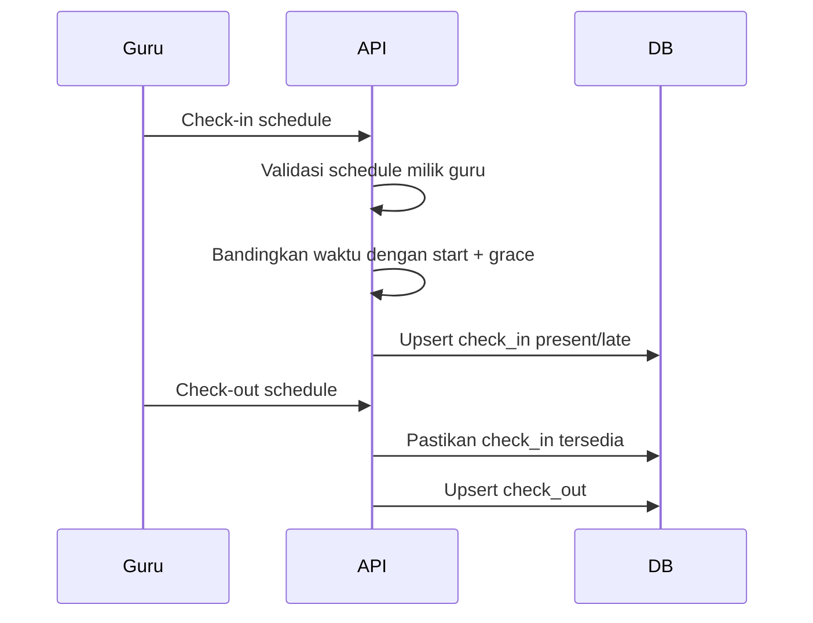
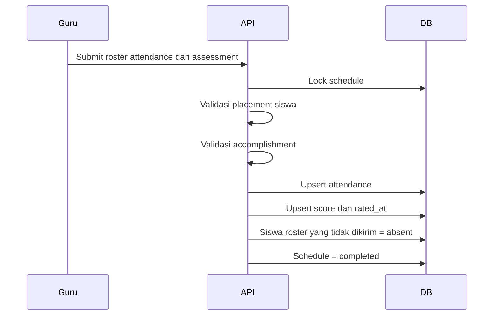
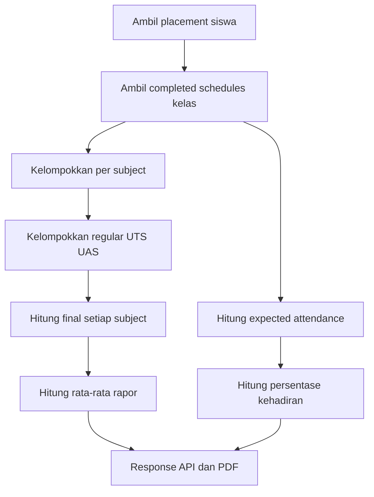
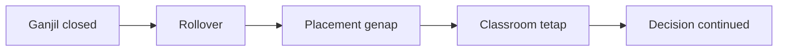
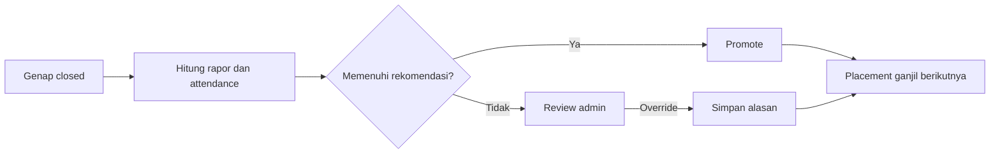

# Aturan Bisnis dan Flow Operasional Santrack

## 1. Tujuan

Santrack menggunakan satu database multi-tahun. Data dipisahkan berdasarkan
instance dan semester, bukan dengan membuat database baru setiap tahun.
Dokumen ini menjadi aturan bersama untuk admin, guru, frontend, backend, dan
QA.

## 2. Istilah

| Istilah | Definisi |
| --- | --- |
| Instance | Satu lembaga/sekolah pemilik seluruh master data |
| Academic year | Satu semester, bukan gabungan satu tahun penuh |
| Periode | `ganjil` atau `genap` |
| Placement | Penempatan siswa pada satu kelas dan satu semester |
| Schedule | Sesi belajar yang menghubungkan semester, guru, kelas, dan mapel |
| Assessment period | Jenis sesi: `regular`, `uts`, atau `uas` |
| Accomplishment | Kompetensi yang dinilai dalam schedule |
| Student assessment | Nilai siswa untuk satu accomplishment |
| Rollover | Perpindahan ganjil ke genap tanpa naik kelas |
| Promotion | Keputusan kelas setelah genap menuju ganjil berikutnya |

## 3. Aturan inti

### 3.1 Ownership

1. Teacher, student, classroom, subject, dan semester wajib mempunyai satu
   `instance_id`.
2. Schedule hanya boleh menghubungkan record dari instance yang sama.
3. Nama dan kode subject unik dalam instance, bukan secara global.
4. Nama classroom unik dalam instance.

### 3.2 Semester

1. Satu record `academic_years` mewakili satu semester.
2. Identitas unik semester adalah `instance_id + name + periode`.
3. Contoh pasangan: `2026/2027 ganjil` dan `2026/2027 genap`.
4. Satu instance hanya boleh memiliki satu semester aktif.
5. Lifecycle semester adalah `draft → active → closed`.
6. Semester `closed` tidak boleh diaktifkan kembali.
7. Semester tidak dapat ditutup jika masih ada schedule selain `completed`
   atau `cancelled`.

### 3.3 Placement siswa

1. Sumber kebenaran kelas siswa adalah
   `student_classroom_placements`.
2. Seorang siswa hanya boleh memiliki satu placement per semester.
3. Perpindahan kelas dalam semester yang sama mengubah placement semester itu.
4. Placement historis tidak ditimpa saat rollover atau promotion.
5. Siswa nonaktif tidak diproses dalam rollover atau promotion.
6. Kapasitas classroom diperiksa sebelum membuat placement.

`students.classroom_id` berstatus `TRANSITIONAL` dan tidak boleh dipakai kode
baru.

## 4. Flow persiapan semester



## 5. Flow schedule

Schedule wajib memiliki semester, teacher, classroom, subject, tanggal, waktu,
dan `assessment_period`.

| Assessment period | Penggunaan |
| --- | --- |
| `regular` | Pembelajaran dan penilaian harian |
| `uts` | Ujian Tengah Semester |
| `uas` | Ujian Akhir Semester |

UTS/UAS tidak boleh ditebak dari nama subject atau accomplishment.

Schedule ditolak jika waktunya beririsan pada teacher atau classroom yang sama.
Jadwal `09:00–10:00` dan `10:00–11:00` boleh berdampingan, sedangkan
`09:30–10:30` berkonflik.



`schedules.is_completed` berstatus `TRANSITIONAL`; kode baru menggunakan
`status` dan `completed_at`.

## 6. Flow absensi guru



Aturan:

1. Guru hanya boleh check-in pada schedule miliknya.
2. Check-out hanya boleh setelah check-in.
3. Check-in setelah `start_time + grace_minutes` berstatus `late`.
4. Retry meng-update record yang sama, bukan membuat duplicate.
5. Report menghitung satu schedule sebagai satu sesi.
6. Schedule lampau tanpa check-in dilaporkan sebagai `absent`.

Default grace adalah 15 menit melalui `SANTRACK_TEACHER_GRACE_MINUTES`.

## 7. Flow absensi dan penilaian siswa



Seluruh proses berada dalam satu transaksi:

- Jika satu nilai gagal, schedule tidak difinalisasi.
- Satu siswa hanya punya satu attendance per schedule.
- Satu siswa hanya punya satu assessment per accomplishment.
- Siswa yang hilang dari payload final otomatis `absent`.
- Status siswa: `present`, `absent`, `sick`, atau `permission`.

## 8. Nilai per mata pelajaran

Nilai tidak dicampur lintas mata pelajaran.

```text
subject_final =
    regular_average × 40%
  + uts_average     × 25%
  + uas_average     × 35%
```

Contoh:

| Mapel | Reguler | UTS | UAS | Final |
| --- | ---: | ---: | ---: | ---: |
| Tahfidz | 80 | 70 | 90 | 81 |
| Akhlak | 60 | 50 | 70 | 61 |

```text
report_average = (81 + 61) / 2 = 71
```

Aturan:

1. Assessment dikelompokkan berdasarkan subject dan periode.
2. Semua nilai dalam periode yang sama dirata-rata.
3. `provisional_score` menormalisasi bobot komponen yang sudah tersedia.
4. `final_score` subject hanya tersedia jika regular, UTS, dan UAS lengkap.
5. Final rapor tersedia jika seluruh subject lengkap.
6. Attendance tidak dicampurkan ke nilai subject.
7. Attendance tetap menjadi syarat terpisah untuk rekomendasi promotion.
8. Domain `knowledge`, `skill`, `attitude`, dan `creativity` dilaporkan per
   subject.

## 9. Flow rapor



Struktur response:

```text
student
classroom
academic_year
attendance
subjects[]
  subject
  assessment_averages
  domain_averages
  provisional_score
  final_score
  missing_components
subject_count
provisional_score
final_score
promotion_recommendation
```

## 10. Penutupan dan transisi

Sebelum menutup semester:

1. Selesaikan atau batalkan semua schedule.
2. Review attendance roster.
3. Review kelengkapan regular, UTS, dan UAS setiap subject.
4. Generate dan review rapor.
5. Buat backup pemulihan sebelum perubahan status.
6. Tutup semester.
7. Buat snapshot final yang sudah memuat status `closed`.

### Ganjil ke genap



Syarat: instance dan nama tahun sama, sumber `ganjil` sudah `closed`, target
`genap`, dan target dimulai setelah sumber.

### Genap ke ganjil berikutnya



Default rekomendasi:

```text
final_score >= 65
attendance_percentage >= 75
```

Admin tetap mengambil keputusan final. Sistem menyimpan semester dan classroom
asal/tujuan, rekomendasi, keputusan, nilai, attendance, alasan override, dan
waktu keputusan.

## 11. Endpoint utama

Semua endpoint memakai prefix `/api/v1`.

| Method | Endpoint | Fungsi |
| --- | --- | --- |
| POST | `/admin/schedules` | Membuat schedule |
| POST | `/schedules/{id}/accomplishments` | Membuat kompetensi |
| POST | `/students/attendances` | Finalisasi attendance dan nilai siswa |
| POST | `/teachers/attendances/create` | Check-in/check-out guru |
| GET | `/reports/performance-students/{classroom_id}` | Rapor kelas |
| GET | `/reports/performance-students/student/{student_id}` | Rapor siswa |
| GET | `/reports/performance-students/student/{student_id}/export/pdf` | PDF rapor |
| POST | `/admin/academic-years/{id}/close` | Menutup semester |
| POST | `/admin/academic-years/{id}/rollover` | Rollover |
| POST | `/students/promoted` | Promotion |

Alias salah eja `/reports/perfomance-students/...` masih `TRANSITIONAL`.

Payload promotion wajib menyebut `source_academic_year_id`,
`target_academic_year_id`, `target_classroom_id`, dan `student_ids`. Semester
sumber tidak ditebak dari semester aktif karena promotion dilakukan setelah
semester sumber ditutup. Endpoint ini hanya untuk admin.

## 12. Checklist QA

1. Schedule adjacent boleh; overlap ditolak.
2. Retry attendance tidak menambah duplicate.
3. Siswa yang tidak dikirim menjadi absent.
4. UTS/UAS masuk ke subject yang benar.
5. Nilai dua subject tidak tercampur.
6. Check-in terlambat menghasilkan `late`.
7. Check-out tanpa check-in ditolak.
8. Rollover mempertahankan classroom.
9. Promotion hanya memindahkan siswa terpilih.
10. Placement dan decision historis tetap ada.
11. Semester dengan schedule terbuka tidak dapat ditutup.
12. Semester closed tidak dapat diaktifkan kembali.
