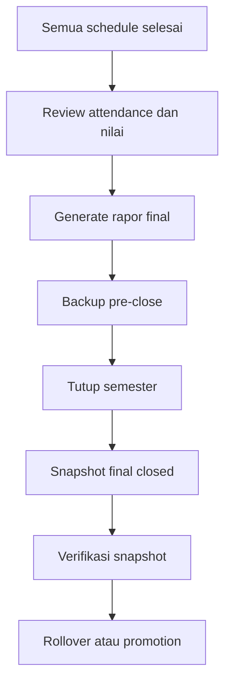
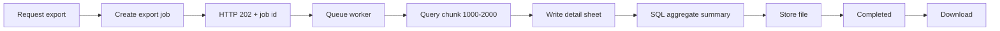

# Operasional Backup dan Export

## 1. Backup bukan database tahunan

Santrack memakai satu database multi-tahun. Data semester lama tetap disimpan
dan difilter menggunakan `academic_year_id`.

| Mekanisme | Tujuan |
| --- | --- |
| Backup | Memulihkan seluruh sistem |
| Snapshot semester | Membekukan kondisi ketika rapor diterbitkan |
| Archive | Memindahkan data sangat lama ke storage murah |
| Export report | Dokumen pengguna, bukan disaster recovery |

## 2. Kebijakan minimum

| Jenis | Frekuensi | Retensi minimum |
| --- | --- | --- |
| Binary log/PITR | Berkelanjutan | 7–30 hari |
| Full snapshot | Setiap malam | 14–30 hari |
| Offsite backup | Mingguan | 8–12 minggu |
| Snapshot semester | Saat semester ditutup | Jangka panjang |
| Snapshot tahunan | Setelah genap ditutup | Kebijakan lembaga |
| Snapshot migration | Sebelum perubahan schema | Sampai release stabil |
| Restore drill | Bulanan/kuartalan | Simpan hasil |

Backup harus berjalan di layer database/infrastructure, tidak bergantung pada
Laravel scheduler. Status otomasi backup repository saat ini: `PENDING`.

## 3. Flow penutupan semester



Snapshot tidak menjadi alasan untuk menghapus data lama.

## 4. Restore drill

Restore drill membuktikan backup dapat dibaca, direstore ke environment
terisolasi, dan menjalankan flow login serta report. Catat backup ID, timestamp,
waktu mulai/selesai, RPO, RTO, hasil validasi, dan operator.

## 5. Export besar

### Kondisi sekarang

Status: `PENDING OPTIMIZATION`.

Export attendance masih memuat seluruh record dengan `get()`, membuat
collection transformasi, mengelompokkan ulang di memory, membangun workbook
penuh, dan menjalankan direct download synchronous. Sekitar 44.000 row masih
di bawah batas Excel, tetapi flow ini berisiko timeout/OOM.

### Target flow



Target:

1. Export tidak synchronous.
2. Detail memakai query builder/join dan chunk.
3. Summary dihitung SQL `GROUP BY`.
4. Detail dan summary dipisah.
5. Hindari Eloquent graph besar dan `ShouldAutoSize`.
6. Status file: `queued`, `processing`, `completed`, `failed`.
7. File dibersihkan berdasarkan retensi.

Index kandidat yang harus diuji dengan `EXPLAIN`:

```sql
CREATE INDEX schedules_report_idx
ON schedules (academic_year_id, date, teacher_id, status);

CREATE INDEX teacher_attendances_schedule_type_status_idx
ON teacher_attendances (schedule_id, type, status);
```

Jangan menambah index ke production tanpa menguji execution plan dan dampak
write.

## 6. Monitoring

Monitor keberhasilan dan umur backup, restore drill, pertumbuhan tabel, durasi
serta memory export, failed jobs, storage report, dan durasi migration.
Keberhasilan report email bukan bukti database sudah dibackup.
