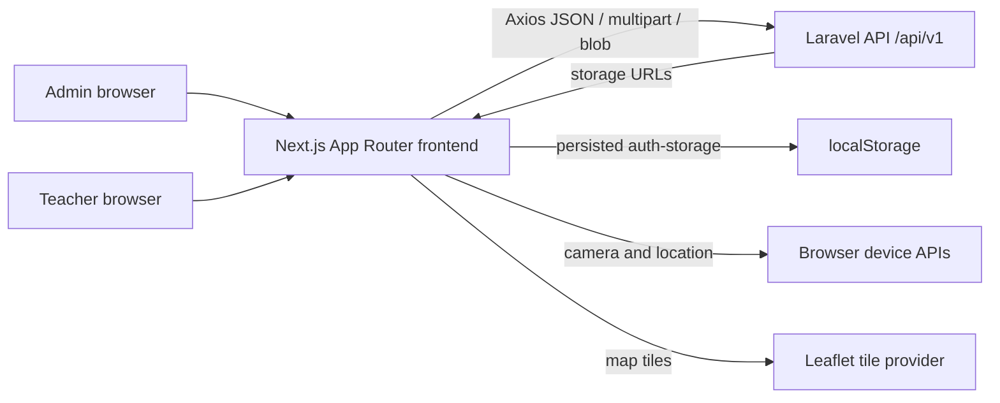
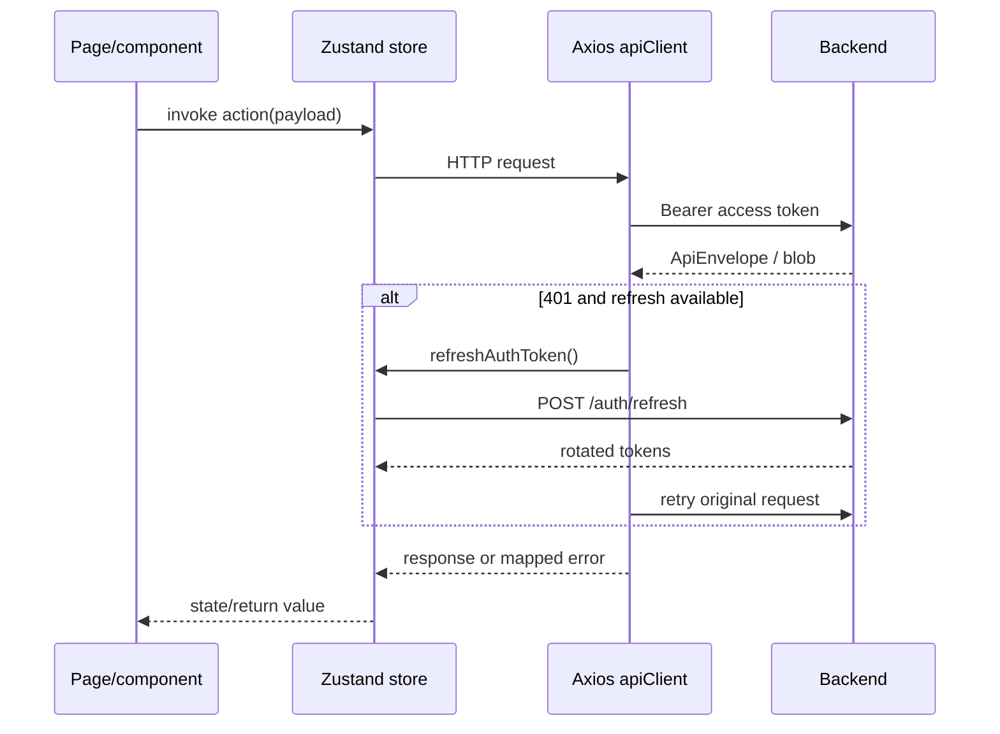

# 01. System Overview

## Purpose and users

**Verified:** metadata in `app/layout.tsx` identifies SIPTA as "Sistem Informasi
Pembelajaran TPA Arrahman". The UI provides dashboard schedules, teacher and
classroom management, student attendance and assessments, academic-year
workflow, teacher attendance reporting, and student performance reporting.

- `admin`: teacher, classroom, subject, schedule, academic-year, student, and
  promotion administration.
- `teacher`: daily schedule, classroom participation, attendance, assessment,
  profile, and reports within backend authorization.

## System context



`app/layout.tsx` is the only Next.js layout. `app/providers.tsx` installs the
HeroUI provider, initializes Zustand auth, and installs Axios interceptors.
Pages under `app/` fetch data through stores in `src/state/`, which call clients
in `src/infrastructure/`.

## Responsibility split

| Frontend | Backend |
| --- | --- |
| Navigation, visual state, form capture, device APIs, download handling | Authentication authority, instance scoping, validation, persistence |
| Sends selected student, classroom, semester, attendance and assessment IDs | Schedule conflict, capacity, semester transition, promotion eligibility |
| Displays report results | Performance calculation and report truth |
| Stores access/refresh tokens and token expiry metadata | Issues, rotates, and revokes tokens |

All route pages except static error/not-found surfaces are client components.
No Server Actions, React Query, SWR, SSE, or WebSocket usage was found.

## Main request lifecycle



## Navigation flow

```mermaid
flowchart TD
  Login[/auth/login/] --> Dashboard[/]
  Dashboard --> Teachers[/teachers admin/]
  Dashboard --> Classes[/classroom/]
  Classes --> Student[/classroom/student/:id/]
  Dashboard --> Schedules[/schedules/]
  Dashboard --> Reports[/reports/]
  Reports --> StudentReport[/reports/students/:id/]
  Dashboard --> Profile[/profile/]
```

## Semester history capability

**Verified backend-facing client capability:** `reportApi.canonicalPerformanceStudent`
accepts an optional `academicYearId`. **Missing UI:** current report pages do not
expose an academic-year selector and still render the legacy response. See
`21-semester-student-report.md` for the approved frontend extension boundary.

