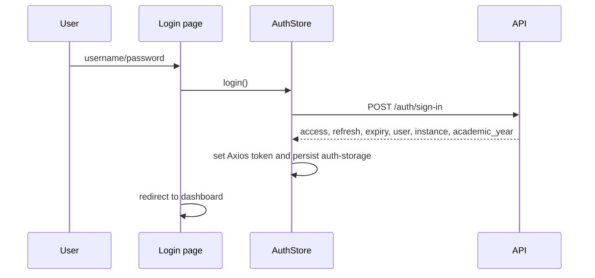
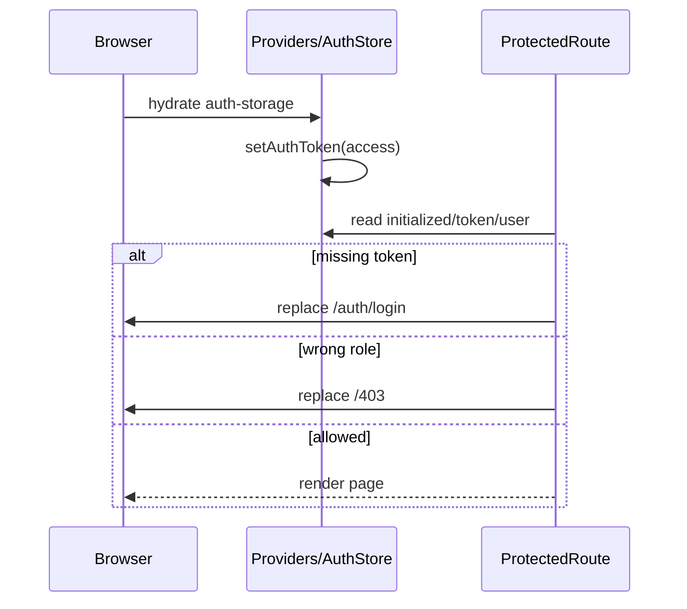
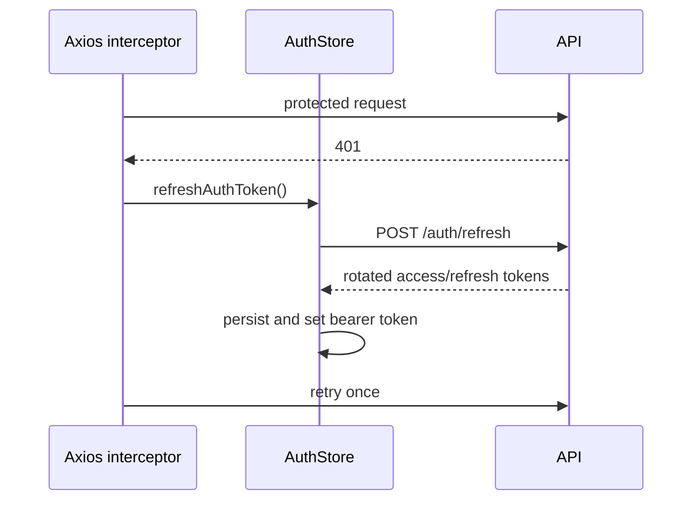

# 10. Authentication and Authorization

## Login

`app/auth/login/page.tsx` uses React Hook Form and also handles browser
permission guidance. There is no registration flow.

## Session restoration and access

`app/providers.tsx` calls `initializeAuth()`. AuthStore rehydrates
`auth-storage`, restores the Axios bearer token, and schedules token-validity
checks. `ProtectedRoute.tsx` waits for initialization and checks token, user, and
role before rendering.

## Expiry and refresh

Transient statuses 408, 429, 500, 502, 503, and 504 are retry candidates.
Inspect `SetupInterceptor.ts` before changing retry count/timing.

## Logout

AuthStore sends the refresh token in `DELETE /auth/sign-out`, clears Axios auth
and Zustand state, then removes `auth-storage` and `academic-years`.

## Authorization matrix

- Admin-only: `/teachers`; classroom/student mutation controls; promotion;
  academic-year and instance administration.
- Admin and teacher: dashboard, classes, schedules, reports, profile.
- Backend authorization remains authoritative.

## Security risks

- Tokens are stored in localStorage, exposing them to successful XSS.
- Multiple components parse persisted auth directly rather than using selectors.
- `ProtectedRoute` has its direct token-validity call commented out.
- No `middleware.ts`; first paint/redirect is client-side.
- `next.config.ts` includes development and tunnel image hosts.

High-risk files: `AuthStore.ts`, `AuthApi.ts`, `Instance.ts`,
`SetupInterceptor.ts`, `ProtectedRoute.tsx`, `providers.tsx`, and
`LocalStorageAuth.ts`.

