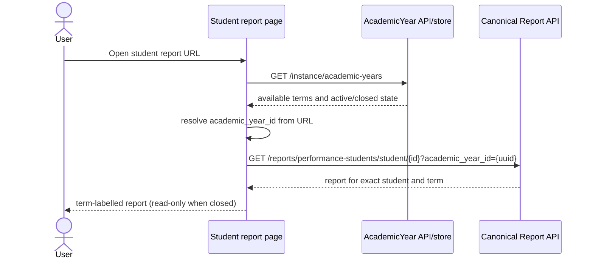

# 21. Student Report by Semester

## Goal and scope

Allow an authorized user to open one student's report and select any available semester without changing the operational active semester. This document is an implementation contract for a future FE change; no report UI or business logic is changed by this documentation task.

## Verified current state

- Student report route: `/reports/students/[student_id]` in `app/reports/students/[student_id]/page.tsx`.
- Another legacy detail route exists at `/classroom/student/[student_id]`.
- Semester inventory is available through `academicYearApi.getAcademicYears()` / `AcademicYearStore.fetchAcademicYears()`.
- `reportApi.canonicalPerformanceStudent(studentId, academicYearId)` already supports `academic_year_id` on the correctly spelled canonical endpoint.
- Current pages/stores primarily use legacy `perfomance-students` methods and do not expose a semester selector.
- Existing PDF export uses the legacy endpoint and has no semester argument.

## Required UX contract

Use the existing route and encode selection in the URL:

```text
/reports/students/{student_id}?academic_year_id={academic-year-uuid}
```

The UUID must come from the academic-year API. Do not derive it from a label such as “2026/2027 - Ganjil”. URL state makes a copied link, reload, browser navigation, and support diagnosis deterministic.

### Selection rules

1. Fetch all academic years available to the current instance.
2. Read `academic_year_id` from the URL.
3. If the parameter matches an available term, select it.
4. Otherwise select the active academic year and replace/update the URL.
5. If no active year exists, select the newest available term only as a presentation fallback and label it accurately.
6. On selection, call the canonical student report with both `student_id` and the selected UUID.
7. Never call `setActiveAcademicYear` merely to view history.

## Request flow



## View-model boundary

Adapt the canonical envelope once, outside presentational components. A stable view model should include, when supplied by the API:

- student identity and STIFIN-related display fields;
- classroom/placement for the selected term;
- academic-year ID, name, semester/term label, dates, and status;
- student/teacher attendance summaries relevant to the report;
- subjects, accomplishments/assessment scores, capability/completeness state;
- rank, totals, or promotion recommendation only when returned by the backend.

Do not calculate authoritative ranks, promotion eligibility, semester continuity, or assessment completion in the UI. If a field is absent, show “data belum tersedia”; do not synthesize it.

## Proposed FE structure

The following is a **recommendation**, not existing implementation:

```text
app/reports/students/[student_id]/
└── page.tsx                         # route orchestration and URL state
app/components/reports/students/
├── SemesterSelector.tsx            # academic-year selection only
├── StudentReportView.tsx           # read-only presentation
├── StudentReportSkeleton.tsx
├── StudentReportEmptyState.tsx
└── StudentAssessmentEditor.tsx     # active/current term only, if retained
```

Keep `ReportApi.ts` as the API boundary and add typed DTO/view-model definitions under `src/domain/` or a report-specific type module. Do not create a second API client.

## Active versus historical behavior

| Selected term | Read report | Edit assessment | Transition/promote | Banner |
| --- | --- | --- | --- | --- |
| Active/open | Yes | Only where current role and existing business rules allow | Not from report view | “Semester aktif” |
| Closed/historical | Yes | No | No | “Arsip semester — hanya baca” |
| Missing placement/report | Show precise empty state | No | No | Identify selected semester |
| API error | Show retry/error, not empty report | No | No | Preserve selected semester |

Going from odd to even semester should preserve students through backend placement/rollover logic. The report reader must query the selected academic-year ID; it must not assume current classroom membership represents historical placement.

## PDF/export contract

Export must represent the currently selected `academic_year_id`. The existing `exportPerformanceStudentPDF(studentId)` is legacy and cannot prove this. Before exposing a per-semester export button, confirm the canonical backend PDF endpoint and add an explicit API method such as:

```ts
exportCanonicalPerformanceStudentPDF(studentId, academicYearId)
```

This name is illustrative. The actual method/endpoint must follow verified backend routing. Never silently export the active term while a historical term is displayed.

## State and feedback

- `loading years`: disable selector and show page skeleton;
- `loading report`: keep semester label visible and show content skeleton;
- `no terms`: explain that no academic period exists;
- `no report/placement`: distinguish valid empty data from transport failure;
- `401/403`: use existing auth/forbidden behavior;
- `closed term`: show persistent read-only label and render no edit control;
- changing term quickly: ignore/cancel stale responses so an older response cannot overwrite the latest selection.

No new global store is required unless multiple routes truly share this selection. URL state plus existing academic-year store and component request state is sufficient.

## Acceptance tests

- [ ] A student with odd and even semester data can switch between both without activating either term.
- [ ] Reload and copied URL display the same selected semester.
- [ ] Request query contains the exact selected UUID.
- [ ] Classroom/placement shown belongs to the selected semester.
- [ ] Closed semester has no assessment mutation controls.
- [ ] Active semester retains authorized existing edit behavior.
- [ ] Missing history is an empty state, while API failure offers retry.
- [ ] Fast switching never renders a response under the wrong semester label.
- [ ] Browser Back/Forward restores semester selection.
- [ ] PDF, once supported by a verified canonical endpoint, matches the visible semester.
- [ ] Mobile and keyboard users can operate and understand the selector.

## Out of scope

Backend migration, repairing production data, changing rollover/promotion rules, reactivating archived semesters, inventing missing assessments, and redesigning unrelated pages are outside this FE feature.
